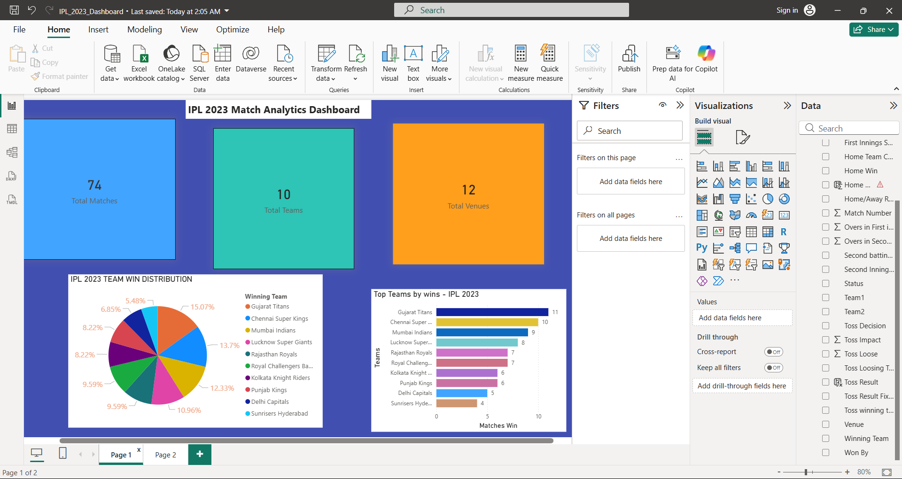
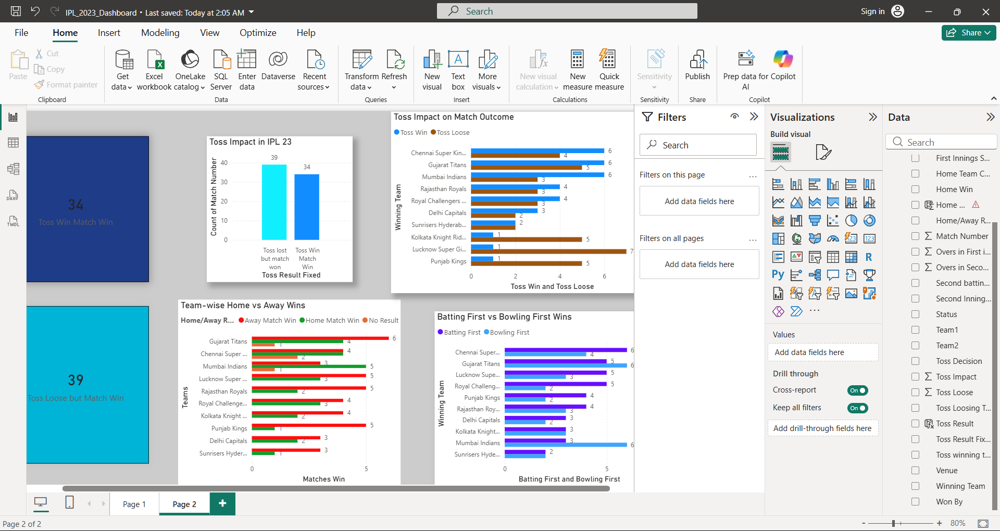

📊 IPL 2023 Data Analysis Dashboard

This project analyzes IPL 2023 match data using Microsoft Excel and Power BI to uncover key insights about team performance, match outcomes, and game strategies.

---

🛠 Tools Used

📌 Excel

- Microsoft Excel
- Pivot Tables
- Data Cleaning
- Data Visualization

📌 Power BI

- Power BI Desktop
- Power Query
- DAX (Data Analysis Expressions)

---

📈 Analysis Performed

- Home vs Away Wins
- Toss Impact on Match Results
- Batting First vs Bowling First Performance
- Team Win Distribution
- Win Percentage by Team

---

📊 Power BI Dashboard (Advanced Analysis)

An interactive dashboard was created in Power BI to provide deeper insights and better visualization of IPL 2023 data.

🔍 Key Features:

- Toss Impact Analysis
- Home vs Away Advantage
- Batting vs Bowling Strategy
- Team-wise Performance Comparison

📸 Dashboard Preview:
  

💡 Key Insights

- Away teams won slightly more matches than home teams.
- Toss does not have a major impact on match outcomes.
- Teams batting first had a slight advantage.
- Gujarat Titans recorded the highest win percentage.

---

🚀 Conclusion

This project demonstrates how data analytics tools like Excel and Power BI can be used to extract meaningful insights from sports datasets and support data-driven decision making.

---

📌 Author

Soumotirtha Das
B.Tech IT (RCCIIT) | Data Analytics Enthusiast

